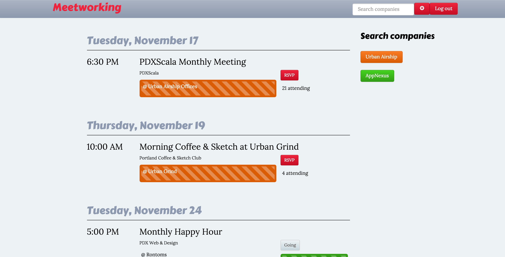

# Meetworking

Looking for an elusive job in tech? Lost in the sea of Meetups? Meetworking helps you target up to three companies, showing you the Meetups those employees are attending as well as the events held at that company's location—a quick way to get your foot in the door. See talking points for each attendee and RSVP right through the app.

### The code

Meetworking uses the SNOB X (pronounced "Snob ten" ;) ) stack: MySQL, Node, Backbone and Express. It relies heavily on the wonderful tools of Knex, Passport, Bluebird, Jade and Jasmine. We love open source and are so thankful to finally be a part of this community.

### How it works

Meetworking is written in JavaScript with Jade templating. After authenticating with OAuth 2.0 and Passport.js, job seekers fill out a profile, choosing up to three companies to "follow". On signup, a cascade of Meetup API calls kicks off, pulling in that member's data as well as events that are happening at the chosen companies. A weekly crawler retrieves member data for thousands of Meetup members in the Portland area, and these bios are what is searched to attempt to find employees who may match the targeted companies.

You can see more about our project at our [wiki](https://github.com/MeetWorking/meetworking-app/wiki).
